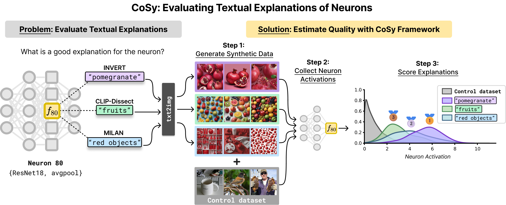

<br/><br/>
<p align="center">
  
<h3 align="center"><b>CoSy: Evaluating Textual Explanations of Neurons</b></h3>
<p align="center">
  PyTorch

  </p>

This repository contains the code and experiments for the paper **[CoSy: Evaluating Textual Explanations of Neurons](https://openreview.net/forum?id=vVpefYmnsG)** by Kopf et al., 2024. 

<!--[](anonymous)-->
<!---->
<!--[](https://github.com/psf/black)-->
<!--[](https://badge.fury.io/py/metaquantus)-->
<!--[](https://github.com/annahedstroem/MetaQuantus/actions/workflows/python-publish.yml/badge.svg)-->
<!--[](anonymous)-->

## Citation

If you find this work interesting or useful in your research, use the following Bibtex annotation to cite us:

```bibtex
@inproceedings{kopf2024cosy,
  title={{CoSy: Evaluating Textual Explanations of Neurons}},
  author={Kopf, Laura and Bommer, Philine Lou and Hedström, Anna and Lapuschkin, Sebastian and Höhne, Marina M. -C. and Bykov, Kirill},
  year={2024},
  url={......}
}
```
This work is in review.

## Table of Contents
1. [About](#about)
2. [Repository overview](#repository-overview)
3. [How to run](#how-to-run)
4. [Installation](#installation)

## About

</p>
<p align="center">
  
</p>

**Evaluating Neuron Explanations** In Explainable AI (XAI) there are methods which connect neurons in Deep Neural Networks (DNNS) to human-understandable textual descriptions. Evaluating the quality of these explanations is challenging due to the lack of a unified quantitative approach. We introduce CoSy (Concept Synthesis), a novel, architecture-agnostic framework for evaluating textual explanations of latent neurons. Given textual explanations, our proposed framework uses a generative model conditioned on textual input to create data points representing the explanations, comparing the neuron's response to these and control data points to estimate explanation quality. We validate our framework through meta-evaluation experiments and benchmark various concept-based textual explanation methods for Computer Vision tasks, revealing significant differences in quality.

## Repository overview

The repository is organized for ease of use:
- The `src/` folder contains all necessary functions.
- The `notebooks/` folder includes notebooks for generating the plots in the paper.
- The `assets/explanations/` folder includes pre-computed explanations for various explanation methods across

## How to run

First, download your control dataset, e,g, [ImageNet](https://www.image-net.org/download.php) or [Places365](http://places2.csail.mit.edu/download.html), and set the path to your dataset [here](https://github.com/lkopf/cosy/blob/main/src/utils.py#L12).

#### 0. Collect Explanations with Explanation Methods

If you wish to evaluate other explanations than the pre-computed ones in `assets/explanations/`, follow the instuctions of the project pages listed below to generate textual explanations of neurons:

- [MILAN](https://github.com/evandez/neuron-descriptions)
- [FALCON](https://github.com/NehaKalibhat/falcon-explain)
- [CLIP-Dissect](https://github.com/Trustworthy-ML-Lab/CLIP-dissect)
- [INVERT](https://github.com/lapalap/invert)

Place the generated csv file with the textual explanations in the `assets/explanations/` folder.

#### 1. Collect Activations

Collect activations for your model specifying your control dataset. In the example below, we select `resnet18` as target model, the `avgpool` layer for inspection, and the ImageNet validation dataset as the control dataset. 

```bash
python src/activation_collector.py --target_model resnet18 --target_layer avgpool --dataset imagenet
```

#### 2. Generate Explanation Images
In this step, generate the concept images for your neuron explanations. Define `METHOD` and `MODEL_NAME`. For our example, set `METHOD=INVERT` and `MODEL_NAME=resnet18-avgpool`.

```bash
torchrun src/image_generator.py --nproc_per_node=3
```

Use the ``--nproc_per_node`` argument to specify the number of GPUs to use. For more information on distributed inference follow these [instructions](https://huggingface.co/docs/diffusers/main/en/training/distributed_inference).

#### 3. Evaluate Explanations
In the last step, evaluate the neuron explanations with CoSy. For example, evaluate a set of neuron explanations of the `avgpool` layer from `resnet18` generated by the `INVERT` explanation method.

```bash
python src/evaluation.py --target_model resnet18 --target_layer avgpool --method INVERT
```

## Installation

Install the necessary packages using the provided [requirements.txt](https://github.com/lkopf/cosy/blob/main/requirements.txt):

```bash
pip install -r requirements.txt
```
### Thank you

We hope our repository is beneficial to your work and research. If you have any feedback, questions, or ideas, please feel free to raise an issue in this repository. Alternatively, you can reach out to us directly via email for more in-depth discussions or suggestions. 

📧 Contact us:
- Laura Kopf: lkopf[at]atb-potsdam.de

Thank you for your interest and support!
